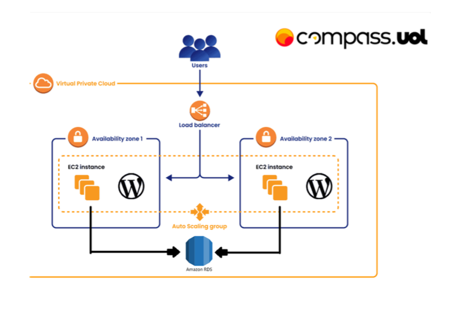
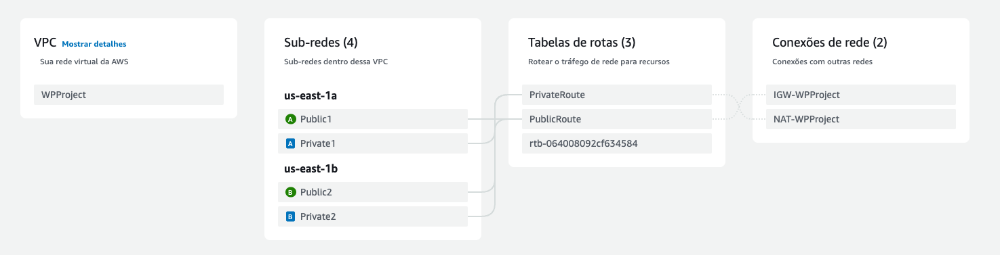

# Docker-WordpressProject-Compass02
Este projeto demonstra a configuração da aplicação Wordpress conteinerizada via Docker. A arquitetura consiste em instâncias EC2 da AWS como host de serviço e ferramentas como Load Balancer e Auto Scalling auxiliando na segurança e integridade do serviço.




# Security Groups

### Configurando o Security Group para o Load Balancer

1. Acesse o console da AWS e navegue até **Security Groups**.
2. Clique em **Create Security Group**.
3. Configure as seguintes informações:
   - **Nome:** LoadBalancer
   - **Descrição:** Security Group para o Load Balancer
   - **VPC:** Selecione a VPC onde o Load Balancer será criado.
4. Na seção **Inbound Rules (Regras de entrada)**, adicione a seguinte regra:
   - **Tipo:** HTTP
   - **Protocolo:** TCP
   - **Porta:** 80
   - **Origem:** 0.0.0.0/0
5. Clique em **Create Security Group** para salvar.
___

### Configurando o Security Group para o Bastion Host

1. Acesse o console da AWS e navegue até **Security Groups**.
2. Clique em **Create Security Group**.
3. Configure as seguintes informações:
   - **Nome:** BastionHost
   - **Descrição:** Security Group para o Bastion Host
   - **VPC:** Selecione a VPC correspondente.
4. Na seção **Inbound Rules (Regras de entrada)**, adicione a seguinte regra:
   - **Tipo:** SSH
   - **Protocolo:** TCP
   - **Porta:** 22
   - **Origem:** 0.0.0.0/0
5. Clique em **Create Security Group** para salvar.
---

### Configurando o Security Group para EC2 Private

1. Acesse o console da AWS e navegue até **Security Groups**.
2. Clique em **Create Security Group**.
3. Configure as seguintes informações:
   - **Nome:** EC2 Private
   - **Descrição:** Security Group para instâncias EC2 em subnets privadas.
   - **VPC:** Selecione a VPC correspondente.
4. Na seção **Inbound Rules (Regras de entrada)**, adicione as seguintes regras:
   - **Tipo:** SSH
     - **Protocolo:** TCP
     - **Porta:** 22
     - **Origem:** 10.0.0.0/16
   - **Tipo:** NFS
     - **Protocolo:** TCP
     - **Porta:** 2049
     - **Origem:** Security Group da EFS
   - **Tipo:** MySQL/Aurora
     - **Protocolo:** TCP
     - **Porta:** 3306
     - **Origem:** Security Group do RDS
   - **Tipo:** HTTP
     - **Protocolo:** TCP
     - **Porta:** 80
     - **Origem:** Security Group do LoadBalancer
5. Clique em **Create Security Group** para salvar.
---

### Configurando o Security Group para o RDS

1. Acesse o console da AWS e navegue até **Security Groups**.
2. Clique em **Create Security Group**.
3. Configure as seguintes informações:
   - **Nome:** RDS
   - **Descrição:** Security Group para o RDS
   - **VPC:** Selecione a VPC onde o RDS será criado.
4. Na seção **Inbound Rules (Regras de entrada)**, adicione a seguinte regra:
   - **Tipo:** MySQL/Aurora
   - **Protocolo:** TCP
   - **Porta:** 3306
   - **Origem:** Security Group EC2 Private
5. Clique em **Create Security Group** para salvar.
___

### Configurando o Security Group para o EFS

1. Acesse o console da AWS e navegue até **Security Groups**.
2. Clique em **Create Security Group**.
3. Configure as seguintes informações:
   - **Nome:** EFS
   - **Descrição:** Security Group para o EFS
   - **VPC:** Selecione a VPC onde o EFS será criado.
4. Na seção **Inbound Rules (Regras de entrada)**, adicione a seguinte regra:
   - **Tipo:** NFS
   - **Protocolo:** TCP
   - **Porta:** 2049
   - **Origem:** Security Group EC2 Private
5. Clique em **Create Security Group** para salvar.

# VPC

### 1. Acesse o Console da AWS
- Abra o [Console de Gerenciamento da AWS](https://aws.amazon.com/console/).

### 2. Navegue para o serviço VPC
- No console da AWS, procure e clique em **VPC** na barra de pesquisa ou no menu de serviços.

### 3. Crie uma nova VPC
- No painel esquerdo, clique em **Your VPCs** e depois em **Create VPC**.
- Preencha os campos da seguinte forma:
    - **VPC name**: WPProject
    - **IPv4 CIDR block**: 10.0.0.0/16
    - **Tenancy**: Default (ou use a opção de **Dedicated** se necessário)
    - Clique em **Create VPC**.
---

### Subnets

### 1. Crie as Sub-redes

Para criar as sub-redes, siga os seguintes passos, utilizando a opção **New subnet** para adicionar todas as sub-redes sem sair da mesma página.

#### Sub-rede: **Public1**
- No painel esquerdo, clique em **Subnets** e depois em **Create subnet**.
- Na página de criação de sub-rede, preencha os seguintes campos:
    - **VPC**: Selecione a VPC **WPProject**.
    - **Subnet name**: Public1
    - **Availability Zone**: `us-east-1a`
    - **IPv4 CIDR block**: `10.0.0.0/24`
- Após preencher os campos, clique em **Add new subnet** para criar mais uma sub-rede sem sair da página.

#### Sub-rede: **Private1**
- Após adicionar **Public1**, preencha os campos para a segunda sub-rede:
    - **VPC**: Selecione a VPC **WPProject**.
    - **Subnet name**: Private1
    - **Availability Zone**: `us-east-1a`
    - **IPv4 CIDR block**: `10.0.1.0/24`
- Clique em **Add new subnet** para adicionar a próxima.

#### Sub-rede: **Public2**
- Agora, adicione a terceira sub-rede:
    - **VPC**: Selecione a VPC **WPProject**.
    - **Subnet name**: Public2
    - **Availability Zone**: `us-east-1a`
    - **IPv4 CIDR block**: `10.0.2.0/24`
- Clique em **Add new subnet** para adicionar a última sub-rede.

#### Sub-rede: **Private2**
- Por fim, adicione a última sub-rede:
    - **VPC**: Selecione a VPC **WPProject**.
    - **Subnet name**: Private2
    - **Availability Zone**: `us-east-1a`
    - **IPv4 CIDR block**: `10.0.3.0/24`
- Após preencher todos os campos, clique em **Create subnet** para concluir a criação de todas as sub-redes.

## Route Tables

### 1. Crie as Tabelas de Roteamento

#### Tabela de Roteamento: **PublicRoute**
- No painel esquerdo, clique em **Route Tables** e depois em **Create route table**.
- Preencha os seguintes campos:
    - **Name**: PublicRoute
    - **VPC**: Selecione a VPC **WPProject**
- Clique em **Create** para criar a tabela de roteamento.

#### Tabela de Roteamento: **PrivateRoute**
- Após criar a tabela **PublicRoute**, clique novamente em **Create route table**.
- Preencha os seguintes campos:
    - **Name**: PrivateRoute
    - **VPC**: Selecione a VPC **WPProject**
- Clique em **Create** para criar a tabela de roteamento privada.

## Internet Gateway

### 1. Crie o Internet Gateway

- No painel esquerdo, clique em **Internet Gateways** e depois em **Create internet gateway**.
- Preencha os seguintes campos:
    - **Name**: IGW-WPProject
- Clique em **Create** para criar o Internet Gateway.

### 2. Anexar o Internet Gateway à VPC

- Após a criação do Internet Gateway, selecione **IGW-WPProject** na lista de gateways.
- Clique em **Actions** e depois em **Attach to VPC**.
- Selecione a VPC **WPProject** e clique em **Attach**.

## NAT Gateway

### 1. Crie o NAT Gateway

- No painel esquerdo, clique em **NAT Gateways** e depois em **Create NAT gateway**.
- Preencha os seguintes campos:
    - **Subnet**: Selecione a sub-rede **Public1**.
    - **Elastic IP**: Clique em **Allocate Elastic IP** para alocar um novo IP elástico para o NAT Gateway.
    - **Name**: NAT-WPProject
- Clique em **Create a NAT Gateway** para criar o NAT Gateway.

## Finalizando configuração da VPC

### 1. Selecione a Tabela de Roteamento Pública

- No painel esquerdo, clique em **Route Tables**.
- Selecione a **route table pública** (por exemplo, **PublicRoute**).

#### Editar as Rotas
- Clique em **Routes** e depois em **Edit route**.
- Clique em **Add route** para adicionar uma nova rota.
    - **Destination**: `0.0.0.0/0`
    - **Target**: Selecione a **Internet Gateway** **IGW-WPProject**.

#### Associar Sub-redes Públicas
- Clique em **Subnet associations**.
- Clique em **Edit subnet associations** e adicione as sub-redes públicas (por exemplo, **Public1** e **Public2**).
- Clique em **Save** para confirmar as alterações.

### 4. Selecione a Tabela de Roteamento Privada

- Agora, selecione a **route table privada** (por exemplo, **PrivateRoute**).

#### Editar as Rotas
- Clique em **Routes** e depois em **Edit route**.
- Clique em **Add route** para adicionar uma nova rota.
    - **Destination**: `0.0.0.0/0`
    - **Target**: Selecione o **NAT Gateway** **NAT-WPProject**.

#### Associar Sub-redes Privadas
- Clique em **Subnet associations**.
- Clique em **Edit subnet associations** e adicione as sub-redes privadas (por exemplo, **Private1** e **Private2**).
- Clique em **Save** para confirmar as alterações.

Se tudo deu certo o mapa da sua vpc deverá ser parecido a esse:



# EFS

### 1. Criar o Sistema de Arquivos EFS

- No painel esquerdo, clique em **Create file system**.
- Na página de criação, preencha os seguintes campos:
    - **File system name**: EFSWordpress
    - **VPC**: Selecione a VPC **WPProject**.

### 2. Personalizar Configurações

Clique em **Customize** para personalizar as configurações.

- **Network**: Selecione as **AZs privadas** onde o EFS será montado.
- **Security groups**: Selecione o **Security Group** EFS, garantindo que as instâncias do Wordpress possam acessar o EFS de forma segura.
  
Depois de configurar as opções, clique em **Next**.

### 3. Confirmar Criação

Revise as configurações e clique em **Create** para criar o sistema de arquivos EFS.

# RDS

### 1. Acesse o Console da AWS
- Abra o [Console de Gerenciamento da AWS](https://aws.amazon.com/console/).

### 2. Navegue para o serviço RDS
- No console da AWS, procure e clique em **RDS** na barra de pesquisa ou no menu de serviços.

### 3. Criar a Instância de Banco de Dados

- No painel esquerdo, clique em **Databases** e depois em **Create database**.
- Selecione **Standard Create**.

#### Configuração do Banco de Dados
- **Engine options**: Selecione **MySQL** e a versão **8.0.39**.
- **License model**: Selecione **Free tier**.
- **DB Instance Identifier**: Nome de indentificação
- **Master username**: Crie usuário
- **Master password**: Crie a senha

#### Tipo de Instância
- **DB Instance Class**: Selecione **db.t3.micro** (tamanho da instância para uso no Free Tier).

#### Configuração de Rede
- **VPC**: Selecione a VPC **WPProject**.
- **DB Subnet Group**: Selecione a opção **Create new DB Subnet Group** para criar um novo grupo de sub-redes para o RDS.
- **Public Accessibility**: Selecione **No** (não público).

#### Segurança
- **VPC Security Group**: Selecione o **RDS** (grupo de segurança do RDS).
  
#### Zonas de Disponibilidade
- **Availability Zone**: Selecione **No preference**.

#### Configurações do Banco
- **Initial database name**: wordpress

### 4. Finalizar a Criação

Depois de revisar todas as configurações, clique em **Create database** para iniciar a criação do RDS.


# Sript user_data.sh

### Instalação do Docker e Docker Compose

Esta parte do script automatiza a instalação do **Docker** e **Docker Compose** em uma máquina Linux Ubuntu.

```bash
sudo apt update
sudo apt install -y docker.io
sudo systemctl start docker
sudo usermod -aG docker $(whoami)
sudo curl -L "https://github.com/docker/compose/releases/download/1.29.2/docker-compose-$(uname -s)-$(uname -m)" -o /usr/local/bin/docker-compose
sudo chmod +x /usr/local/bin/docker-compose
```

### Criação do docker-compose.yaml

Aqui criamos o arquivo `docker-compose.yaml` com os parametros já preenchidos e pronto para a execução

```bash
mkdir ~/dc && cd ~/dc

cat << EOF > docker-compose.yaml
version: '3'

services:
  wordpress:
    image: wordpress:latest
    restart: always
    ports:
      - "80:80"
    environment:
      WORDPRESS_DB_HOST: <RDS Endpoint>>
      WORDPRESS_DB_USER: <user>
      WORDPRESS_DB_PASSWORD: <password>
      WORDPRESS_DB_NAME: <database name>
    volumes:
      - /efs/wordpress:/var/www/html

EOF
```

### EFS

Use o seguinte trecho para montar o EFS

```bash
sudo mkdir -p /efs
sudo apt-get update
sudo apt-get upgrade
sudo apt-get install -y nfs-common
sudo mount -t nfs4 -o nfsvers=4.1,rsize=1048576,wsize=1048576,hard,timeo=600,retrans=2,noresvport IDENTIFICADOR_DO_EFS.amazonaws.com:/ /efs
echo "IDENTIFICADOR_DO_EFS.amazonaws.com:/ /efs nfs4 defaults,_netdev 0 0" | sudo tee -a /etc/fstab
```
Substitua "IDENTIFICADOR_DO_EFS" pelo Id do seu filesystem criado pelo EFS AWS

### Subir WordPress via Docker Compose

Para subir o containner do Wordpress via Docker use o seguinte comando:

```bash
docker-compose up -d
```

# EC2 Template


### Passos para Criar um Launch Template de EC2

### 1. Criar o Launch Template

1. No painel do **EC2**, no menu lateral, clique em **Launch Templates**.
2. Clique no botão **Create launch template** para criar um novo template.

### 2. Informar o Nome do Template

- Na página de criação do template, forneça um **Nome** para o seu Launch Template, como `WordpressProjectTemplate`.

### 3. Selecionar a AMI (Sistema Operacional)

- Em **AMI** (Amazon Machine Image), selecione a opção para o **Ubuntu Server 24.04 LTS**.
  - Selecione a **AMI Ubuntu Server 24.04 LTS** na lista de AMIs disponíveis.

### 4. Selecionar o Tipo de Instância

- Em **Instance type**, selecione o tipo de instância **t2.micro**.

### 5. Configuração da Chave (Key Pair)

- Em **Key pair**, crie ou selecione uma chave SSH para a sua instância. Essa chave será utilizada para conectar à instância depois de criada.
  - Se você não tiver uma chave existente, clique em **Create new key pair** e siga as instruções para criar a chave.

### 6. Configurações de Rede

- Em **Network settings**, selecione uma das suas **subnets privadas** dentro da **VPC** configurada para a sua rede.
  - Escolha uma subnet privada de sua VPC que você deseja que a instância seja associada.

### 7. Configurar o Security Group

- Em **Security group**, selecione o Security Group **EC2 Private** existente.
### 8. Usar `user_data.sh`
- Em **Advanced details** insira o script que será executado automaticamente quando a instância for inicializada. O script pode ser usado para automatizar a instalação de pacotes ou a configuração da instância. Segue o exemplo:

```bash
#!/bin/bash

#Instalar Docker e Docker compose

sudo apt update
sudo apt install -y docker.io
sudo systemctl start docker
sudo usermod -aG docker $(whoami)
sudo curl -L "https://github.com/docker/compose/releases/download/1.29.2/docker-compose-$(uname -s)-$(uname -m)" -o /usr/local/bin/docker-compose
sudo chmod +x /usr/local/bin/docker-compose

#Criar docker-compose.yaml

mkdir ~/dc && cd ~/dc

cat << EOF > docker-compose.yaml
version: '3'

services:
  wordpress:
    image: wordpress:latest
    restart: always
    ports:
      - "80:80"
    environment:
      WORDPRESS_DB_HOST: 
      WORDPRESS_DB_USER: 
      WORDPRESS_DB_PASSWORD: 
      WORDPRESS_DB_NAME: 
    volumes:
      - /efs/wordpress:/var/www/html

EOF

#EFS

sudo mkdir -p /efs
sudo apt-get update
sudo apt-get upgrade
sudo apt-get install -y nfs-common
sudo mount -t nfs4 -o nfsvers=4.1,rsize=1048576,wsize=1048576,hard,timeo=600,retrans=2,noresvport IDENTIFICADOR_DO_EFS.amazonaws.com:/ /efs
echo "IDENTIFICADOR_DO_EFS.amazonaws.com:/ /efs nfs4 defaults,_netdev 0 0" | sudo tee -a /etc/fstab


#Montar Wordpress via Docker Compose

docker-compose up -d
```

### 9. Revisar e Criar o Template

- Revise todas as configurações.
- Clique em **Create launch template** para finalizar a criação do template.

# Load Balancer

Distribui o tráfego de rede entre várias instâncias para alta disponibilidade.

### 1. Acesse o Console da AWS
- Faça login no console e acesse **EC2**.

### 2. Criar o Load Balancer
- Vá para **Load Balancers** e clique em **Create Load Balancer**.
- Selecione **Application Load Balancer**.

### 3. Configurações Básicas
- Nomeie o ALB (ex: `LB-Wordpress`).
- Escolha **internet-facing** e **ipv4**.

### 4. Configurar Listeners
- Adicione listeners, como **HTTP (port 80)**.

### 5. Configurar Redes
- Selecione a **VPC** e pelo menos duas **subnets públicas** em diferentes zonas de disponibilidade.

### 6. Configurar Security Groups
- Selecione o Security Group **LoadBalancer** permitindo tráfego nas portas do listener.

### 7. Criar Target Group
- Crie um **target group** e registre suas instâncias EC2 para receber o tráfego.

### 8. Revisar e Criar
- Revise as configurações e clique em **Create**.

### 9. Testar
- Acesse o DNS público do ALB para verificar se o tráfego está sendo distribuído corretamente entre as instâncias.

Agora seu **Application Load Balancer** está configurado para gerenciar e distribuir o tráfego entre as instâncias EC2.

# Auto Scaling

Ajusta automaticamente a quantidade de instâncias EC2 para atender à demanda.

### 1. Criar um Launch Configuration ou Launch Template
- Vá para **Auto Scaling Groups** e clique em **Create Auto Scaling group**.
- Selecione o **Launch Template** criado com a instância EC2 que será escalada.

### 2. Definir o Auto Scaling Group
- Nomeie o **Auto Scaling Group** (ex: `ASG-WordpressProject`).
- Escolha a **VPC** e as **subnets** onde as instâncias serão lançadas.

### 3. Definir Políticas de Escala
- Configure as políticas para **scaling up** e **scaling down** baseadas em métricas como uso de CPU ou tráfego.

Ajusta automaticamente a quantidade de instâncias EC2 para atender à demanda.

# Passos opcionais

## Bastion Host

### 1. Acesse o Console da AWS
- Faça login no console da AWS e acesse **EC2**.

### 2. Iniciar a Instância Bastion
- Clique em **Launch Instance**.
- Selecione **Ubuntu 24.04 LTS** como a aplicação.
- Escolha o tipo de instância **t2.micro**.
- Selecione a **mesma Key Pair** usada anteriormente para acessar outras instâncias.

### 3. Configurar a Rede
- Escolha a **mesma VPC** utilizada pelas outras instâncias.
- Selecione uma **subnet pública**.
- Ative **Auto-assign Public IP** para garantir que a instância tenha um IP público acessível.

### 4. Configurar o Security Group
- Selecione o **Security Group** existente chamado **Bastion**, garantindo que a porta **22 (SSH)** esteja aberta para seu IP ou rede.

### 5. Configurar o Armazenamento
- Defina o armazenamento como **8 GiB gp3**.

### 6. Lançar a Instância
- Revise as configurações e clique em **Launch Instance**.

### 7. Acessar o Bastion Host

- Conecte-se à instância do **Bastion Host** via SSH utilizando o IP público atribuído:
  
```bash
ssh -i /caminho/para/sua/key.pem ubuntu@<IP_PUBLICO_BASTION>
```

### 8. Acesse as maquinas privadas via Bastion Host

- Use a Bastion Host para acessar as maquinas nas subnets privadas, se necessário, transfira a chave .pem para a BAstion e a use para acessar as demais instâncias.

```bash
ssh -i /caminho/para/sua/key.pem ubuntu@<IP_PRIVADO_INSTANCIA_PRIVADA>
```


